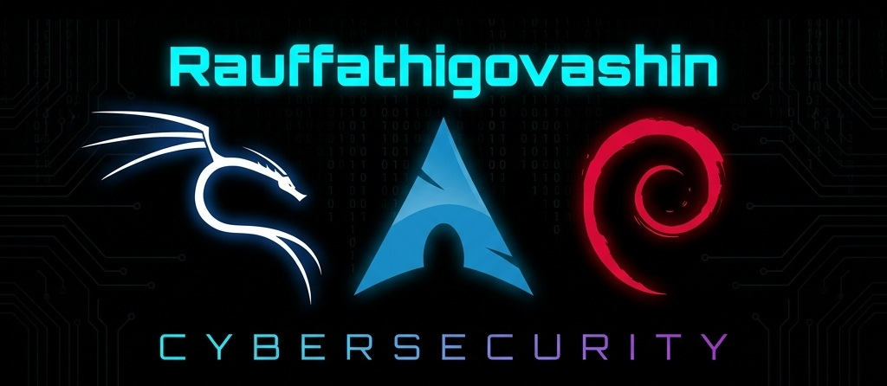

<div align="center">

<!-- CYBERSECURITY BANNER -->


<br/>

<!-- TYPING ANIMATION -->
[](https://github.com/rauffathigovashin)

---

<!-- PROFILE VIEWS & FOLLOWERS -->

[](https://github.com/rauffathigovashin?tab=followers)
[](https://github.com/rauffathigovashin?tab=stars)

</div>

---

## 🧑‍💻 Haqqımda

```yaml
name: Rauf Fathi Govashin
location: Baku, Azerbaijan 🇦🇿
education: Azerbaijan University
role: Developer & Cybersecurity Enthusiast
website: https://rauffathigovashin.netlify.app/
interests:
  - 🔐 Kiber Təhlükəsizlik (Cybersecurity)
  - 🛡️ Penetration Testing
  - 🌐 Şəbəkə Təhlükəsizliyi (Network Security)
  - 🐍 Python ilə Alət İnkişafı
  - 🖥️ Linux Sistemləri
```

> *"Rəqəmsal dünyamıza xoş gəlmisiniz! Mən praktik alətlər yaratmağa və kiber təhlükəsizlik sahəsində inkişaf etməyə həvəsli bir developeram."*

---

## 🛠️ Texnologiyalar & Dillər

<div align="center">

### 💻 Proqramlaşdırma Dilləri

<a href="https://www.python.org/" target="_blank">
  
</a>
&nbsp;&nbsp;&nbsp;
<a href="https://www.ruby-lang.org/" target="_blank">
  
</a>
&nbsp;&nbsp;&nbsp;
<a href="https://www.gnu.org/software/bash/" target="_blank">
  
</a>
&nbsp;&nbsp;&nbsp;
<a href="https://isocpp.org/" target="_blank">
  
</a>

<br/><br/>

| Dil | Səviyyə |
|:---:|:---:|
| 🐍 **Python** | ████████████████████ **İleri** |
| 💎 **Ruby** | ████████████████░░░░ **Orta-İleri** |
| 🖥️ **Bash** | ████████████████░░░░ **Orta-İleri** |
| ⚡ **C++** | ████████████░░░░░░░░ **Orta** |

<br/>

### 🔧 Alətlər & Platformalar


<br/><br/>


</div>

---

## 🚀 Əsas Layihələr

<div align="center">

<a href="https://github.com/rauffathigovashin/RFG-SEC-SUITE">
  
</a>
<a href="https://github.com/rauffathigovashin/SecretNotesPy">
  
</a>
<a href="https://github.com/rauffathigovashin/MacChangerLinux">
  
</a>
<a href="https://github.com/rauffathigovashin/NetworkScanningTool">
  
</a>
<a href="https://github.com/rauffathigovashin/ARP-Spoof-ManintheMiddle">
  
</a>
<a href="https://github.com/rauffathigovashin/WebsiteCrawler-Spider-">
  
</a>

</div>

---

## 📊 GitHub Statistikaları

<div align="center">


&nbsp;&nbsp;


<br/><br/>

<!-- STREAK STATS -->


<br/><br/>

<!-- ACTIVITY GRAPH -->


</div>

---

## 🏆 GitHub Trofeyləri

<div align="center">


</div>

---

## 🐍 Kontribusiya İlanı

<div align="center">

<picture>
  <source media="(prefers-color-scheme: dark)" srcset="https://raw.githubusercontent.com/rauffathigovashin/rauffathigovashin/output/github-snake-dark.svg" />
  <source media="(prefers-color-scheme: light)" srcset="https://raw.githubusercontent.com/rauffathigovashin/rauffathigovashin/output/github-snake.svg" />
  
</picture>

</div>

---

## 📫 Əlaqə

<div align="center">

[](https://rauffathigovashin.netlify.app/)
[](https://www.instagram.com/rauffathigovashin/)
[](https://github.com/rauffathigovashin)

</div>

---

<div align="center">


</div>

